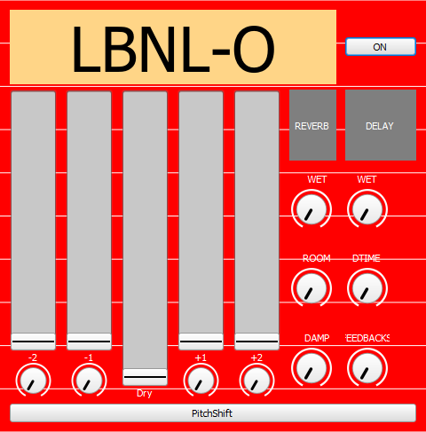

# group14-hw-SC-LastButNotLeast
Group 14 repository for the SC homework of CMLS 2022

## Last But Not Least - Components
- 10628467 - Riccardo Rossi
- 10834943 - Hou Hin Au Yeung
- 10679682 - Ferdinando Terminiello
- 10611785 - Francesco Piferi
- 10885119 - Mattia Massimi

## Assignment 4 - Octaver

## The Idea

**LBNL-O** is a SuperCollider-made effects box which consists of two different types of octavers for analogue sygnals and added effects (delay and reverb). The two octavers are implemented in two ways:
- **RM (Ring Modulation) Octaver**
- **Polyphonic (PitchShift) Octaver**

## HOWTO
To correctly run the SuperCollider Code one needs to follow these steps:

1. Install the latest version of SuperCollider
2. Change the folder path (at line 6) with the folder containing the file GUI.sc (leaving to "./" could work but it's not assured)
    >>>
        ~folderPath = "YOUR PATH HERE";
    >>>  
3. Either comment out or change the default audio input and output interfaces of the Server (lines 13, 14, 15)
    >>>
        o = Server.default.options; 
        o.inDevice_("//YOUR CODE HERE//");
        o.outDevice_("//YOUR CODE HERE//");
    >>>
4. Run the first block of code *between the () parentheses*
5. In SuperCollider, go to *Language* and select *Recompile Class Library* (or press *Ctrl + shift + L*)
6. Repeat step 4
7. Run the second block of code
8. **ENJOY IT !!**

If everything works correctly, a window should pop up containing the program's GUI. **Note: when the GUI is closed, the server closes with it automatically.**

## Troubleshooting
- Latency depends a lot from the audio input and output devices used. For better performances, a dedicated external audio interface is recommended
